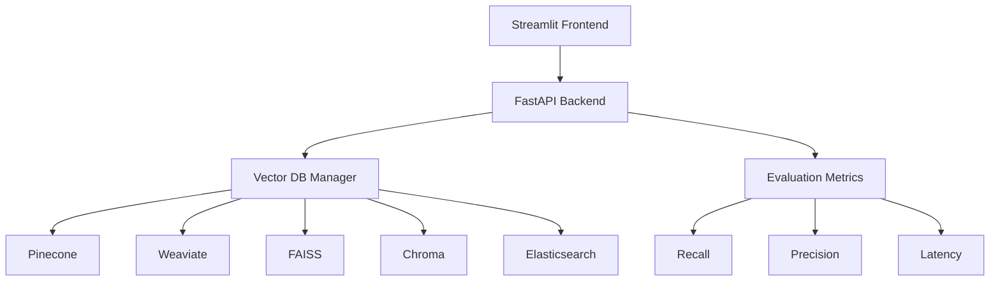

# Fraud RAG Vector Database Evaluation

This project demonstrates a simple evaluation of different Vector Databases for Fraud Detection using RAG (Retrieval Augmented Generation) approach. The application provides a user-friendly interface to compare performance metrics across different vector databases.

## Architecture



## Features

- Interactive Streamlit UI for easy comparison
- Support for multiple vector databases:
  - Pinecone (Cloud)
  - Weaviate (Cloud)
  - FAISS (Local)
  - Chroma (Local)
  - Elasticsearch (Cloud)
- Performance metrics evaluation:
  - Recall
  - Precision
  - Query latency
- Simple fraud detection use case

## Setup

1. Install dependencies:
```bash
pip install -r requirements.txt
```

2. Set up environment variables:
```bash
cp .env.example .env
# Edit .env with your API keys and configurations
```

3. Run the application:
```bash
# Start FastAPI backend
uvicorn app.backend.main:app --reload

# Start Streamlit frontend
streamlit run app/frontend/main.py
```

## Cloud Database Setup Instructions

### Pinecone Setup

1. Create a Pinecone account at https://www.pinecone.io/
2. Create a new project and index:
   - Go to the Pinecone console
   - Create a new project
   - Create a new index with:
     - Name: `fraud-index` (or your preferred name)
     - Dimension: 128
     - Metric: cosine
     - Pod type: Choose based on your needs (starter, standard, or dedicated)

3. Get your API key and environment:
   - Go to API Keys section
   - Copy your API key
   - Note your environment (e.g., `gcp-starter`, `us-west1-gcp`)

4. Update your `.env` file:
```env
PINECONE_API_KEY=your_api_key_here
PINECONE_ENVIRONMENT=your_environment_here
PINECONE_INDEX_NAME=fraud-index
```

### Weaviate Setup

1. Create a Weaviate Cloud account at https://console.weaviate.io/
2. Create a new cluster:
   - Choose your preferred region
   - Select the appropriate tier (sandbox, starter, or professional)
   - Wait for cluster creation

3. Get your credentials:
   - Go to your cluster details
   - Copy the cluster URL
   - Generate an API key

4. Update your `.env` file:
```env
WEAVIATE_URL=your_cluster_url_here
WEAVIATE_API_KEY=your_api_key_here
```

### Elasticsearch Setup

1. Create an Elastic Cloud account at https://cloud.elastic.co/
2. Create a new deployment:
   - Choose your preferred region
   - Select the appropriate tier (free trial, standard, or premium)
   - Wait for deployment creation

3. Get your credentials:
   - Go to your deployment
   - Copy the deployment URL
   - Note your username (usually 'elastic')
   - Reset your password if needed

4. Update your `.env` file:
```env
ELASTICSEARCH_URL=your_deployment_url_here
ELASTICSEARCH_USERNAME=elastic
ELASTICSEARCH_PASSWORD=your_password_here
```

## Project Structure

```
.
├── app/
│   ├── backend/
│   │   ├── main.py
│   │   ├── vector_db/
│   │   │   ├── base.py
│   │   │   ├── pinecone.py
│   │   │   ├── weaviate.py
│   │   │   ├── faiss.py
│   │   │   ├── chroma.py
│   │   │   └── elasticsearch.py
│   │   └── evaluation/
│   │       └── metrics.py
│   └── frontend/
│       └── main.py
├── data/
│   └── sample_fraud_data.json
├── requirements.txt
└── .env.example
```

## Usage

1. Access the Streamlit interface at `http://localhost:8501`
2. Select the vector databases you want to compare
3. For cloud databases:
   - Enter your credentials in the sidebar
   - The application will automatically configure the connection
4. Upload or use sample fraud data
5. View performance metrics and comparisons

## Security Notes

- Never commit your `.env` file with real credentials
- Use environment variables for sensitive information
- Consider using a secrets management service for production
- Regularly rotate your API keys
- Monitor your cloud resource usage

## License

MIT 