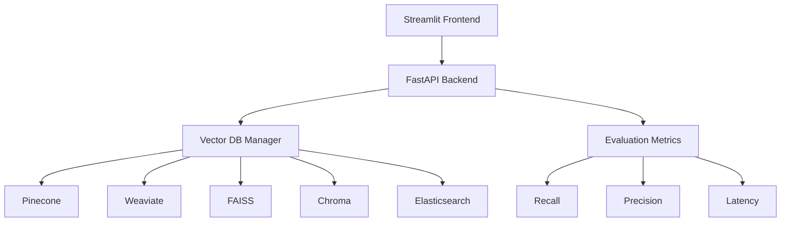

# Fraud RAG Vector Database Evaluation

This project demonstrates a simple evaluation of different Vector Databases for Fraud Detection using RAG (Retrieval Augmented Generation) approach. The application provides a user-friendly interface to compare performance metrics across different vector databases.

## Architecture



## Features

- Interactive Streamlit UI for easy comparison
- Support for multiple vector databases:
  - Pinecone
  - Weaviate
  - FAISS
  - Chroma
  - Elasticsearch
- Performance metrics evaluation:
  - Recall
  - Precision
  - Query latency
- Simple fraud detection use case

## Setup

1. Install dependencies:
```bash
pip install -r requirements.txt
```

2. Set up environment variables:
```bash
cp .env.example .env
# Edit .env with your API keys and configurations
```

3. Run the application:
```bash
# Start FastAPI backend
uvicorn app.backend.main:app --reload

# Start Streamlit frontend
streamlit run app/frontend/main.py
```

## Project Structure

```
.
├── app/
│   ├── backend/
│   │   ├── main.py
│   │   ├── vector_db/
│   │   │   ├── base.py
│   │   │   ├── pinecone.py
│   │   │   ├── weaviate.py
│   │   │   ├── faiss.py
│   │   │   ├── chroma.py
│   │   │   └── elasticsearch.py
│   │   └── evaluation/
│   │       └── metrics.py
│   └── frontend/
│       └── main.py
├── data/
│   └── sample_fraud_data.json
├── requirements.txt
└── .env.example
```

## Usage

1. Access the Streamlit interface at `http://localhost:8501`
2. Select the vector databases you want to compare
3. Upload or use sample fraud data
4. View performance metrics and comparisons

## License

MIT 